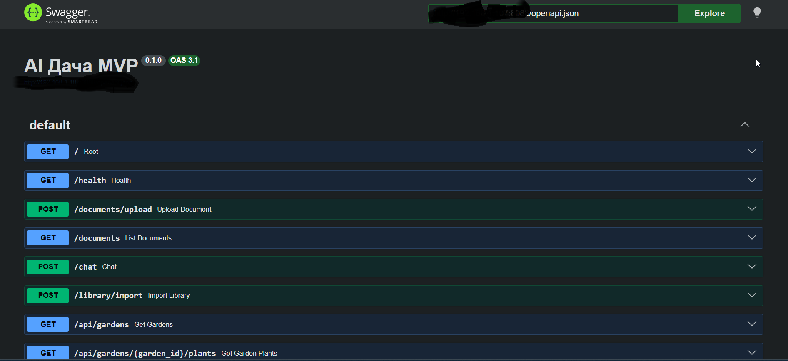
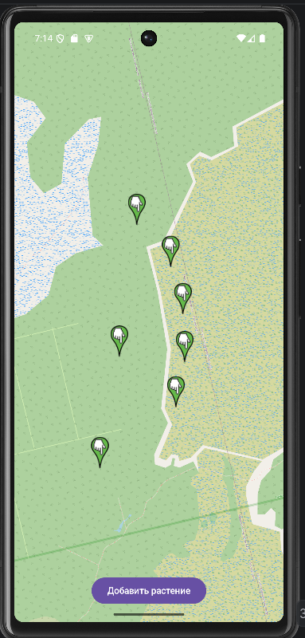

# AI Dacha

AI-assisted garden management platform with:

- local LLM integration (Ollama)
- RAG over gardening books
- PostgreSQL + pgvector
- PostGIS geospatial storage
- mobile map prototype
- document ingestion pipeline

## Main ideas behind the project

The project explores how AI can be integrated into a real information system instead of being used only as a standalone chatbot.

Current experiments include:

- storing plants and their locations on a map;
- processing gardening books and reference PDFs;
- splitting documents into chunks;
- generating embeddings for semantic search;
- storing vectors in PostgreSQL with pgvector;
- using PostGIS for geospatial objects;
- querying local LLM models through Ollama;
- building API endpoints for frontend/mobile clients.

## Autonomous AI Agents

The project also experiments with autonomous AI agents responsible for external knowledge ingestion and catalog enrichment.

One of the current experimental agents is a Rose Catalog Agent which:

- crawls public nursery websites;
- detects rose-related pages;
- extracts rose product cards;
- normalizes cultivar names;
- enriches metadata using a local LLM (Ollama);
- stores structured catalog data in PostgreSQL.

The enrichment pipeline combines:

- rule-based extraction;
- normalization logic;
- local LLM inference;
- structured JSON generation.

The long-term goal is building AI-assisted structured gardening knowledge bases suitable for semantic search and future RAG workflows.

## Current state

Current MVP includes:

- document upload experiments;
- chunk storage in PostgreSQL;
- pgvector semantic search;
- local Ollama integration;
- geospatial storage for plants;
- simple mobile map prototype;
- architecture and data model documentation.

The project is still evolving and many parts are experimental.

## Tested environment

The project is currently tested in a home lab environment using:

- QNAP TS-673A NAS;
- NVIDIA RTX 3090;
- Docker / Portainer;
- Ollama local inference;
- PostgreSQL + pgvector + PostGIS.

## Repository structure
```
ai-dacha/
├── README.md
├── docker-compose.yml
├── .env.example
├── agents/
│   └── rose-agent/
├── docs/
│   ├── architecture/
│   ├── api/
│   ├── database/
│   └── requirements/
├── examples/
└── screenshots/
```
Why PostgreSQL

PostgreSQL was intentionally selected because it allows combining:

relational data;
vector search with pgvector;
geospatial data with PostGIS;

inside a single database engine.

This significantly simplifies the architecture for experimental AI systems.

Technology stack
```
Backend API - FastAPI 
Database - PostgreSQL 
Vector search - pgvector 
Geospatial data - PostGIS 
LLM runtime - Ollama 
Embeddings - local embedding model
OCR / PDF processing - OCR worker service 
Containerization - Docker / Docker Compose 
Mobile prototype - Android / map interface 
```

Core AI pipeline
```
PDF document
  ↓
OCR / text extraction
  ↓
Text normalization
  ↓
Chunking
  ↓
Embedding generation
  ↓
Storage in PostgreSQL + pgvector
  ↓
Semantic search
  ↓
Context assembly
  ↓
LLM response generation
```

## Autonomous Catalog Ingestion Pipeline

```text
Internet nursery websites
    ↓
Crawler agent
    ↓
Page classification
    ↓
Product extraction
    ↓
Normalization
    ↓
LLM enrichment (Ollama)
    ↓
Structured PostgreSQL catalog
    ↓
Semantic / AI-ready knowledge base
```

## Example use cases

### 1. Ask questions about gardening books

User uploads gardening books or reference PDFs.  
The system extracts text, creates chunks, generates embeddings, and allows semantic search over the document base.

Example:

> "Какие растения лучше посадить в полутени рядом с забором?"

The system retrieves relevant chunks from the document base and sends them as context to the LLM.

### 2. Store plants on a garden map

The user can add a plant to a map:

- plant name;
- plant type;
- coordinates;
- comment;
- planting date;
- custom notes.

The geometry is stored in PostGIS.

### 3. Combine plant data and AI recommendations

The system can combine:

- plant location;
- soil or area notes;
- documents from the knowledge base;
- LLM reasoning.

Example:

> "Что можно посадить рядом с розой у забора?"

## API examples

See [`docs/api/api-examples.md`](docs/api/api-examples.md).

## Database model

See [`docs/database/er-diagram.md`](docs/database/er-diagram.md).

## Screenshots

### Swagger / OpenAPI



### Mobile map prototype



## Status

The project is under active development and is intended to demonstrate:

- system analysis skills;
- data modeling;
- AI/LLM integration;
- document processing pipeline;
- PostgreSQL + pgvector + PostGIS usage;
- API-oriented architecture.

## Roadmap


## Author

Igor Polovitski

System Analyst focused on AI/LLM systems, data pipelines and knowledge ingestion architectures.
