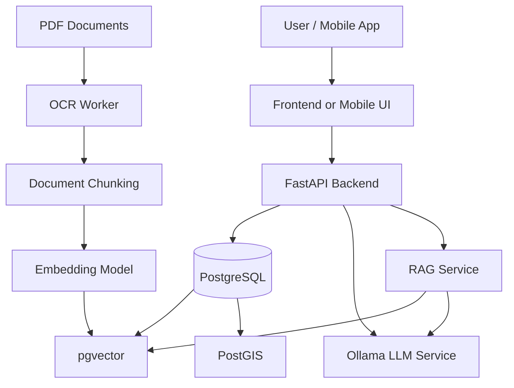

# AI Dacha

**AI Dacha** is an experimental AI-assisted garden management platform.

The project combines document processing, RAG over gardening books, plant cataloging, geospatial data storage, and a mobile map interface.

The goal of the project is to demonstrate how AI/LLM can be used not only as a chatbot, but as part of a real applied information system.

## Project goals

AI Dacha is designed to help manage a garden plot and related knowledge:

- store plants and their locations on a map;
- process PDF books and reference materials;
- split documents into chunks;
- generate embeddings for semantic search;
- store vectors in PostgreSQL with pgvector;
- use PostGIS for geospatial objects;
- query local LLM models through Ollama;
- provide API endpoints for frontend/mobile clients.

## MVP scope

This repository contains a minimal public MVP structure:

```text
ai-dacha/
├── README.md
├── docker-compose.yml
├── .env.example
├── docs/
│   ├── architecture/
│   │   ├── architecture.md
│   │   └── architecture.mmd
│   ├── api/
│   │   └── api-examples.md
│   ├── database/
│   │   ├── er-diagram.md
│   │   └── er-diagram.mmd
│   └── requirements/
│       └── mvp-requirements.md
├── examples/
│   └── curl-examples.sh
└── screenshots/
    └── README.md
```

## High-level architecture



## Technology stack

| Area | Technology |
|---|---|
| Backend API | FastAPI |
| Database | PostgreSQL |
| Vector search | pgvector |
| Geospatial data | PostGIS |
| LLM runtime | Ollama |
| Embeddings | local embedding model, for example `nomic-embed-text` |
| OCR / PDF processing | OCR worker service |
| Containerization | Docker / Docker Compose |
| Mobile prototype | Android / map interface |

## Core AI pipeline

```text
PDF document
  ↓
OCR / text extraction
  ↓
Text normalization
  ↓
Chunking
  ↓
Embedding generation
  ↓
Storage in PostgreSQL + pgvector
  ↓
Semantic search
  ↓
Context assembly
  ↓
LLM response generation
```

## Example use cases

### 1. Ask questions about gardening books

User uploads gardening books or reference PDFs.  
The system extracts text, creates chunks, generates embeddings, and allows semantic search over the document base.

Example:

> "Какие растения лучше посадить в полутени рядом с забором?"

The system retrieves relevant chunks from the document base and sends them as context to the LLM.

### 2. Store plants on a garden map

The user can add a plant to a map:

- plant name;
- plant type;
- coordinates;
- comment;
- planting date;
- custom notes.

The geometry is stored in PostGIS.

### 3. Combine plant data and AI recommendations

The system can combine:

- plant location;
- soil or area notes;
- documents from the knowledge base;
- LLM reasoning.

Example:

> "Что можно посадить рядом с розой у забора?"

## API examples

See [`docs/api/api-examples.md`](docs/api/api-examples.md).

## Database model

See [`docs/database/er-diagram.md`](docs/database/er-diagram.md).

## Screenshots

Screenshots should be placed in [`screenshots/`](screenshots/).

Recommended screenshots:

- mobile map with plant marker;
- Swagger / OpenAPI page;
- database table in DBeaver;
- document chunk stored in DB;
- vector column example;
- AI answer from local LLM.

## Status

This is a portfolio-oriented MVP repository.

The project is under active development and is intended to demonstrate:

- system analysis skills;
- data modeling;
- AI/LLM integration;
- document processing pipeline;
- PostgreSQL + pgvector + PostGIS usage;
- API-oriented architecture.

## Roadmap

- [ ] Add real backend source code
- [ ] Add OpenAPI specification
- [ ] Add database migration scripts
- [ ] Add mobile client source code
- [ ] Add screenshots
- [ ] Add demo data
- [ ] Add deployment guide
- [ ] Add automated tests

## Author

Igor Polovitsky  
System Analyst / AI & LLM enthusiast
