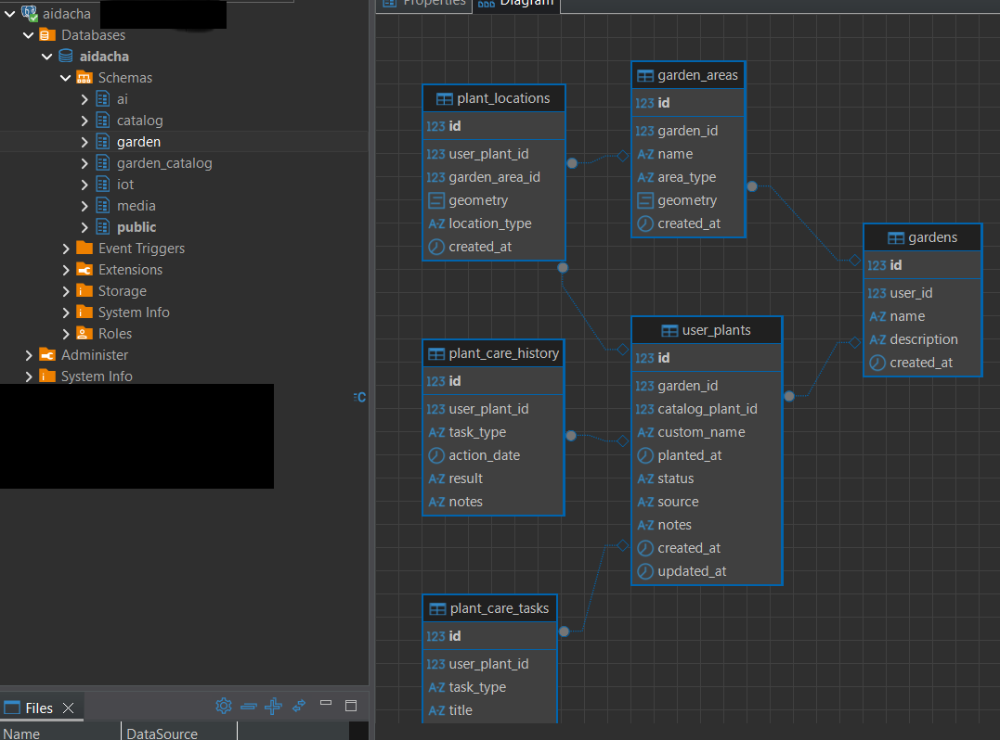
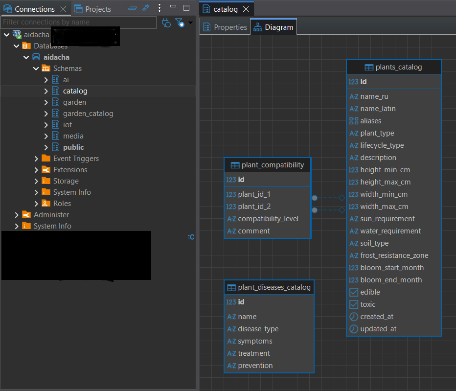
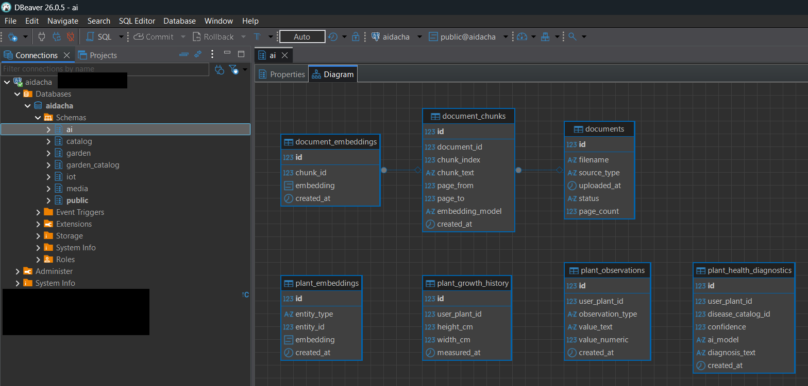
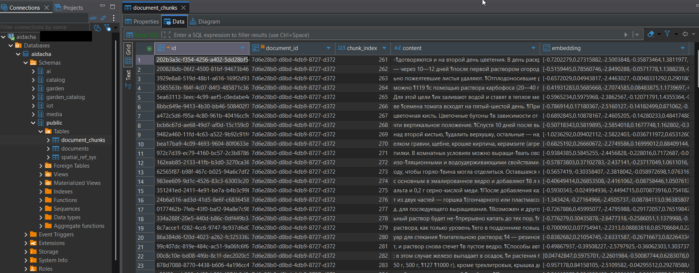

# AI Dacha

AI-assisted garden management platform focused on combining local LLMs, geospatial data, document ingestion and semantic search.

The project combines:

- local LLM integration with Ollama;
- RAG over gardening books and reference materials;
- PostgreSQL + pgvector semantic search;
- PostGIS geospatial storage;
- mobile map prototype;
- document ingestion and OCR pipelines.

---

## Project overview

AI Dacha started as a personal experimental project for exploring local AI/LLM infrastructure and RAG pipelines.

Initially, the project focused on:

- PostgreSQL + pgvector;
- local LLM deployment;
- PDF ingestion;
- semantic search;
- OCR processing.

Later, the project evolved into a prototype of an AI-assisted garden management system with geospatial storage and autonomous catalog enrichment agents.

The project explores how AI can be integrated into a real information system instead of being used only as a standalone chatbot.

---

## Main project areas

Current experiments include:

- storing plants and their locations on a map;
- processing gardening books and reference PDFs;
- document chunking and embedding generation;
- semantic search over gardening knowledge bases;
- geospatial storage using PostGIS;
- querying local LLM models through Ollama;
- API-oriented architecture for frontend/mobile clients;
- autonomous AI agents for catalog ingestion and enrichment.

---

## Autonomous AI Agents

The project also experiments with autonomous AI agents responsible for external knowledge ingestion and catalog enrichment.

One of the current experimental agents is a **Rose Catalog Agent** which:

- crawls public nursery websites;
- detects rose-related pages;
- extracts rose product cards;
- normalizes cultivar names;
- enriches metadata using a local LLM (Ollama);
- stores structured catalog data in PostgreSQL.

The enrichment pipeline combines:

- rule-based extraction;
- normalization logic;
- local LLM inference;
- structured JSON generation.

The long-term goal is building AI-assisted structured gardening knowledge bases suitable for semantic search and future RAG workflows.

---
## Weather and Garden AI Agents

The project now includes experimental AI agents that combine local weather data, forecast data and garden inventory stored in PostgreSQL.

### Weather Data Pipeline

The weather subsystem collects data from two sources:

* Netatmo weather station — local measurements from the garden area;
* Open-Meteo API — hourly weather forecast.

Collected data is stored in PostgreSQL in a dedicated `weather` schema.

Pipeline:

```text
Netatmo Weather Station
        ↓
netatmo-worker
        ↓
PostgreSQL weather.netatmo_current_measurements

Open-Meteo API
        ↓
forecast-worker
        ↓
PostgreSQL weather.weather_forecast
```

The stored weather data includes:

* air temperature;
* humidity;
* atmospheric pressure;
* rain;
* wind speed;
* wind direction;
* wind gusts.

### Weather Agent

Endpoint:

```http
POST /weather/ask
```

The Weather Agent answers weather-related questions using PostgreSQL data instead of querying the internet directly.

Example questions:

```text
Нужно ли сегодня поливать розы?
Будет ли сегодня сильный ветер?
Какая минимальная температура ожидается ночью?
```

The agent uses:

* current Netatmo measurements;
* 24-hour weather forecast;
* local LLM through Ollama.

### Garden Weather Agent

Endpoint:

```http
POST /garden/ask
```

The Garden Weather Agent combines:

* user plants from `garden.user_plants`;
* plant locations from PostGIS;
* current weather measurements;
* hourly weather forecast;
* local LLM reasoning.

Pipeline:

```text
User question
        ↓
Plant matching
        ↓
Selected plant context
        ↓
Weather and forecast context
        ↓
Ollama LLM
        ↓
Garden recommendation
```

Example question:

```text
Нужно ли сегодня поливать розу у забора?
```

Example response logic:

```text
The agent finds the plant "Роза у забора",
loads its planting date, notes and location,
combines this with current humidity, temperature and forecast,
then generates a plant-specific watering recommendation.
```

The API response includes metadata showing which agent processed the request:

```json
{
  "agent_type": "garden_weather_agent",
  "matched_plants_count": 1,
  "plants_sent_to_llm": 1,
  "current_weather_used": true,
  "forecast_hours_used": 24
}
```

This demonstrates a domain-specific AI agent that works not only with text documents, but also with structured PostgreSQL data, geospatial garden data and live weather information.

---

## Current state

Current MVP includes:

- PDF ingestion experiments;
- document chunk storage;
- pgvector semantic search;
- local Ollama integration;
- geospatial plant storage;
- mobile map prototype;
- architecture and data model documentation;
- Swagger / OpenAPI documentation.

The project is under active development and many components are still experimental.

---

## Tested environment

The project is currently tested in a home lab environment using:

- QNAP TS-673A NAS;
- NVIDIA RTX 3090;
- Docker / Portainer;
- Ollama local inference;
- PostgreSQL + pgvector + PostGIS.

---

## Repository structure

```text
ai-dacha/
├── README.md
├── docker-compose.yml
├── .env.example
├── agents/
│   └── rose-agent/
├── docs/
│   ├── architecture/
│   ├── api/
│   ├── database/
│   └── requirements/
├── examples/
└── screenshots/
```

---

## Why PostgreSQL

PostgreSQL was intentionally selected because it allows combining:

- relational data;
- vector search with pgvector;
- geospatial data with PostGIS;

inside a single database engine.

This significantly simplifies the architecture of experimental AI systems and reduces infrastructure complexity.

---

## Technology stack

| Area | Technology |
|---|---|
| Backend API | FastAPI |
| Database | PostgreSQL |
| Vector search | pgvector |
| Geospatial data | PostGIS |
| LLM runtime | Ollama |
| Embeddings | local embedding model |
| OCR / PDF processing | OCR worker service |
| Containerization | Docker / Docker Compose |
| Mobile prototype | Android / map interface |

---

## Core AI pipeline

```text
PDF document
    ↓
OCR / text extraction
    ↓
Text normalization
    ↓
Chunking
    ↓
Embedding generation
    ↓
Storage in PostgreSQL + pgvector
    ↓
Semantic search
    ↓
Context assembly
    ↓
LLM response generation
```

---

## Autonomous catalog ingestion pipeline

```text
Internet nursery websites
    ↓
Crawler agent
    ↓
Page classification
    ↓
Product extraction
    ↓
Normalization
    ↓
LLM enrichment (Ollama)
    ↓
Structured PostgreSQL catalog
    ↓
Semantic / AI-ready knowledge base
```

---

## Example use cases

### 1. Ask questions about gardening books

Users can upload gardening books or reference PDFs.

The system:

1. extracts text;
2. creates chunks;
3. generates embeddings;
4. stores vectors in PostgreSQL;
5. retrieves relevant chunks during semantic search.

Example:

> "Какие растения лучше посадить в полутени рядом с забором?"

Relevant chunks are retrieved from the document base and sent to the local LLM as context.

---

### 2. Store plants on a garden map

The system can store:

- plant name;
- plant type;
- coordinates;
- comments;
- planting date;
- custom notes.

Geometry is stored using PostGIS.

---

### 3. Combine AI recommendations with geospatial data

The project also explores combining:

- plant locations;
- semantic search;
- document knowledge;
- LLM reasoning.

Example:

> "Что можно посадить рядом с розой у забора?"

---

## API examples

See [`docs/api/api-examples.md`](docs/api/api-examples.md).

---

## Database model

See [`docs/database/er-diagram.md`](docs/database/er-diagram.md).

---

## Screenshots

### Swagger / OpenAPI


### Mobile map prototype


---
## Database schemas

### Garden geospatial model



### Plant knowledge catalog



### AI / RAG schema



### Document chunks and embeddings

Example of stored document chunks and vector embeddings inside PostgreSQL.


---

## Planned features

- semantic search over structured plant knowledge bases;
- OCR improvements for scanned gardening books;
- metadata extraction and normalization;
- geospatial filtering;
- AI-assisted planting recommendations;
- expanded autonomous ingestion agents;
- knowledge graph experiments.

---

## Status

The repository is intended as a technical portfolio project demonstrating:

- system analysis;
- AI/LLM integration;
- RAG pipelines;
- PostgreSQL + pgvector usage;
- PostGIS geospatial modeling;
- API-oriented architecture;
- document ingestion workflows;
- autonomous AI agent concepts.

---

## Author

Igor Polovitski

System Analyst focused on AI/LLM systems, data pipelines, semantic search and knowledge ingestion architectures.
