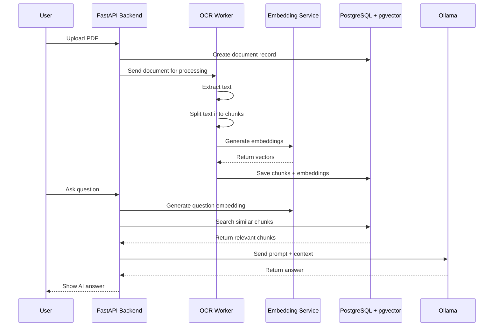
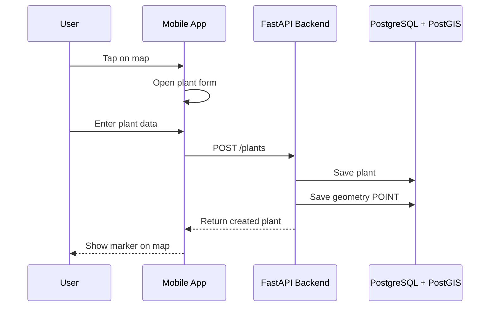

# Architecture

## Context

AI Dacha is a local-first AI system for garden management and document-based knowledge retrieval.

The system combines several subsystems:

1. API backend
2. PostgreSQL database
3. PostGIS geospatial storage
4. pgvector semantic search
5. OCR worker
6. Embedding generation
7. Ollama LLM runtime
8. Mobile or web client

## Main flow: document processing

## Main flow: plant on map

