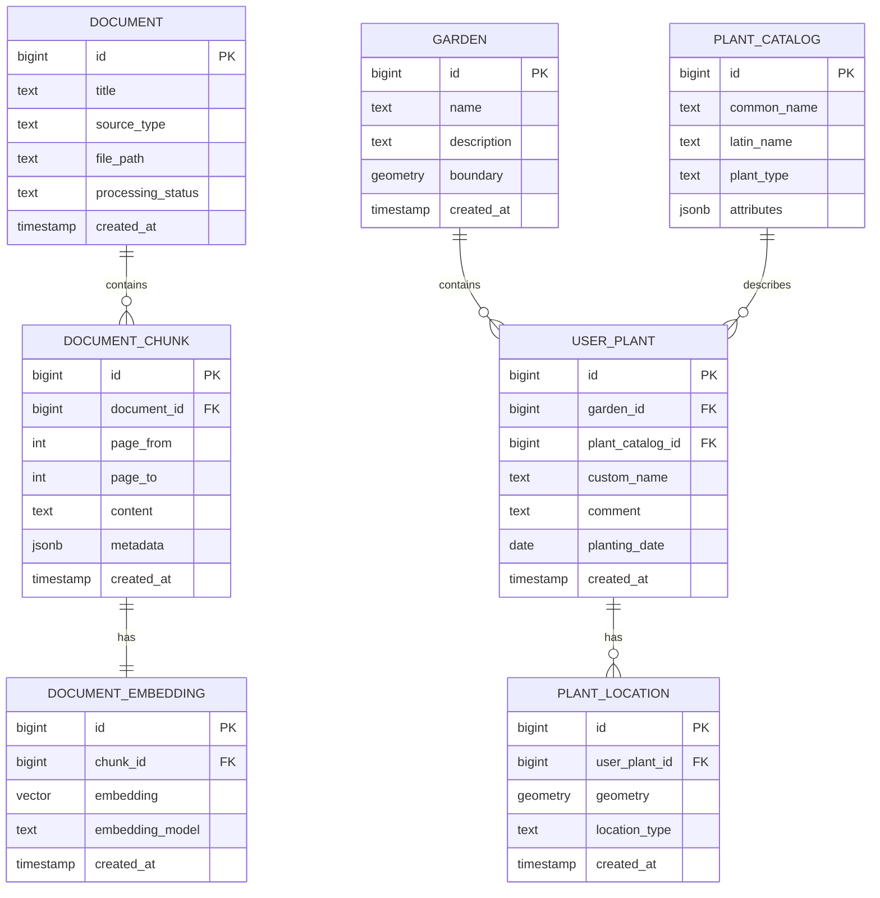

# ER diagram

## Conceptual database model

## Notes

### DOCUMENT

Stores the original uploaded document.

### DOCUMENT_CHUNK

Stores text fragments extracted from PDF documents.  
A chunk may contain text from one or several pages, therefore `page_from` and `page_to` are stored separately.

### DOCUMENT_EMBEDDING

Stores vector representation of each document chunk.  
The `embedding_model` field is important because embeddings from different models should not be mixed without control.

### GARDEN

Stores the garden or land plot.  
The `boundary` field can store polygon geometry.

### USER_PLANT

Stores a specific plant instance owned by the user.

### PLANT_LOCATION

Stores point, line, or polygon geometry for a plant location.
